# Augment 全自动注册助手

全自动完成 Augment 官网注册流程，支持 Gmail 别名和临时邮箱双重方案，使用腾讯云函
数获取验证码。

## 🧠 功能全览思维导图


## 📋 目录

- [🏗️ 项目架构](#️-项目架构)
- [🔄 自动化工作流程](#-自动化工作流程)
- [📁 项目结构](#-项目结构)
- [♻️ 快速配置](#️-快速配置)
  - [方式一：使用配置助手（推荐）](#方式一使用配置助手推荐)
  - [方式二：手动配置](#方式二手动配置)
  - [配置说明](#配置说明)
- [🌟 核心特性](#-核心特性)
  - [🧠 零基础 5 分钟速通 零成本自动抓验证码](#-零基础-5-分钟速通-零成本自动抓验证码)
  - [🔧 验证码获取架构](#-验证码获取架构)
  - [1️⃣ 手机注册 Gmail](#1️⃣-手机注册-gmail)
  - [2️⃣ 电脑把 Gmail → QQ 邮箱实时转发](#2️⃣-电脑把-gmail--qq-邮箱实时转发)
  - [3️⃣ 获取 QQ 邮箱 16 位授权码](#3️⃣-获取-qq-邮箱-16-位授权码)
  - [4️⃣ 云函数实时拉码](#4️⃣-云函数实时拉码)
  - [5️⃣ 代码详解](#5️⃣-代码详解)
  - [6️⃣ 常见疑问](#6️⃣-常见疑问)
- [🤝 支持](#-支持)
  - [🔍 问题排查指南](#-问题排查指南)
- [📜 免责声明（技术研究与合法使用）](#-免责声明技术研究与合法使用)

## 🏗️ 项目架构


## 🔄 自动化工作流程


## 📁 项目结构

```
augment-extension-standalone/
├── 📄 manifest.json          # Chrome扩展配置文件
├── 🎨 popup.html             # 扩展主界面
├── ⚙️ popup.js               # 主逻辑控制器
├── 📜 content.js             # 页面注入脚本
├── 🎯 config.js              # 核心配置文件（需要配置）
├── 📋 config.example.js      # 配置模板文件
├── 🛠️ setup.html             # 配置助手界面
├── 🎨 styles.css             # 样式文件
├── 📁 modules/               # 功能模块目录
│   ├── 📧 email-generator.js # 邮箱生成模块
│   ├── 🔐 verification-code.js # 验证码获取模块
│   └── 💾 storage.js         # 数据存储模块
├── 📁 static/                # 静态资源目录
│   ├── 🖼️ logo.gif           # 扩展图标
│   └── 🎭 *.png/gif          # 其他图标资源
└── 📁 docs/                  # 文档目录
    └── 📖 CONFIG_GUIDE.md    # 详细配置指南
```

## ♻️ 快速配置

**现在所有配置都集中在一个文件中！** 只需要修改 `config.js` 即可完成所有配置。


### 方式一：使用配置助手（推荐）

1. 打开 `setup.html` 文件
2. 填写你的 Gmail 邮箱和云函数 URL
3. 点击生成配置文件
4. 保存为 `config.js` 文件

### 方式二：手动配置

1. 复制 `config.example.js` 为 `config.js`
2. 修改以下两个必要配置：
   ```javascript
   gmail: {
     baseEmail: "your-email@gmail.com", // 改为你的Gmail地址
   },
   cloudFunction: {
     url: "https://your-cloud-function-url.com/get_code", // 改为你的云函数地址
   }
   ```
3. 保存文件并重新加载扩展

### 配置说明

- **Gmail 邮箱**：用于生成别名邮箱（如：your-email+abc123@gmail.com）
- **云函数 URL**：用于获取 Gmail 验证码的腾讯云函数地址
- **其他配置**：临时邮箱、延迟时间等都有默认值，一般不需要修改

详细配置说明请查看 [CONFIG_GUIDE.md](docs/CONFIG_GUIDE.md)

## 🌟 核心特性

### 📘 零基础 5 分钟速通 零成本自动抓验证码

## 🔧 验证码获取架构

```mermaid
graph TB
    subgraph "用户环境"
        A[手机Gmail APP] --> B[注册Gmail账号]
        C[电脑Gmail网页] --> D[设置邮件转发]
    end

    subgraph "邮件流转"
        E[Augment官网] --> F[发送验证码邮件]
        F --> G[Gmail收件箱]
        G --> H[自动转发]
        H --> I[QQ邮箱收件箱]
    end

    subgraph "云端服务"
        J[腾讯云函数] --> K[IMAP连接QQ邮箱]
        K --> L[读取最新邮件]
        L --> M[正则提取验证码]
        M --> N[返回JSON格式]
    end

    subgraph "Chrome扩展"
        O[扩展popup] --> P[调用云函数API]
        P --> Q[获取验证码]
        Q --> R[自动填写页面]
    end

    B --> D
    D --> H
    I --> K
    N --> P

    style A fill:#34a853,color:#fff
    style E fill:#1976d2,color:#fff
    style J fill:#ff9800,color:#fff
    style O fill:#9c27b0,color:#fff
```



────────────────── 0️⃣ 目标(总流程总结) • 手机上注册 Gmail(若没) → 电脑把验证码实
时转发到 QQ 邮箱 → 云函数读取 → 插件脚本自动填进网页。

### 1️⃣ 手机注册 Gmail（3 min）

Q：为什么要用 Gmail APP？ A：亲测秒过人机,电脑注册费时费力

步骤 ① 应用商店搜 Gmail → 安装 → 添加账号 → 创建账号（个人用途）。 ② 国家选中国
+86 → 收短信 → 设密码 → 完成。 ✅ 收件箱出现「欢迎邮件」即成功。

### 2️⃣ 电脑把 Gmail → QQ 邮箱实时转发（2 min）

Q：为什么要转发？ A：国内访问 Gmail 不稳定，QQ 邮箱 IMAP 速度快、云函数直连无墙
。

步骤 ① 电脑登录 mail.google.com → ⚙️ → 查看所有设置 → 转发和 POP/IMAP。 ② 添加转
发地址 → 输入 QQ 邮箱 → 下一步。 ③ QQ 邮箱里找「Gmail Forwarding Confirmation」→
点蓝色确认链接。 ④ 回到 Gmail → 勾选「将收到的邮件副本转发给…」→ 保存。 ✅ QQ 邮
箱收件箱收到测试邮件即成功。

### 3️⃣ 获取 QQ 邮箱 16 位授权码（30 s）

Q：授权码干嘛用？ A：云函数需要它才能登录你的 QQ 邮箱读取邮件，不是 QQ 密码。

步骤 QQ 邮箱 → 设置 → 账户 → IMAP/SMTP 服务 → 发短信 → 复制 16 位授权码。

### 4️⃣ 云函数实时拉码（5 min）

Q：为什么要用云函数？ A：腾讯云每月 100 万次调用免费，域名固定，24 h 在线。

A. 新建  
① 打开 https://console.cloud.tencent.com/scf → 新建 → Web 函数 → Python 3.9 → 地
域广州。  
② 函数代码 → app.py 清空 → 粘贴下方代码，改两行即可：

```python
import imaplib, email, re
from flask import Flask, jsonify
app = Flask(__name__)

@app.route("/get_code")
def get_code():
    USER = '123456@qq.com'        # ← 改成你的 QQ 邮箱
    PASS = 'xxxxxxxxxxxxxxxx'     # ← 改成 16 位授权码
    HOST = 'imap.qq.com'

    mail = imaplib.IMAP4_SSL(HOST, 993)
    mail.login(USER, PASS)
    mail.select('INBOX')
    typ, data = mail.search(None, 'ALL')
    for uid in reversed(data[0].split()):
        typ, msg = mail.fetch(uid, '(RFC822)')
        msg_obj = email.message_from_bytes(msg[0][1])
        frm = str(msg_obj.get('From', '')).lower()
        if 'augmentcode.com' not in frm:   # 发件人过滤，按需改
            continue
        body = ''
        if msg_obj.is_multipart():
            for part in msg_obj.walk():
                if part.get_content_type() == 'text/plain':
                    body = part.get_payload(decode=True).decode('utf-8', 'ignore')
                    break
        else:
            body = msg_obj.get_payload(decode=True).decode('utf-8', 'ignore')
        m = re.search(r'\b\d{6}\b', body)
        if m:
            mail.logout()
            return jsonify(code=m.group())
    mail.logout()
    return jsonify(code='')
```

B. 部署  
保存 → 部署 → 触发管理 → 复制 HTTPS 域名。  
浏览器访问 `https://xxxxx/get_code` 返回 `{"code":"123456"}` 即成功。

🎉 完美 ,你已经全部完成了, 开始体验吧

───────────────────── 下面湿详解 ─────────────────────────

### 5️⃣ 代码详解

> 下面代码详解,看不懂把我腿打断吧

```javascript
// 1. 找到所有可能是验证码输入框的元素
const targets = document.querySelectorAll(
  'input[placeholder*="验证码"], input[placeholder*="verification code"], input[name*="code"]'
);
// 翻译：把页面上 placeholder 里带“验证码” 或 name 里带 “code” 的 input 都抓出来。
// 上例 <input placeholder="请输入验证码"...> 会被命中。

// 2. 对每个抓到的输入框执行同样的操作
targets.forEach((el) => {
  el.value = data.code; // 2-A 把验证码填进去
  el.dispatchEvent(new Event("input", { bubbles: true })); // 2-B 通知 React「值变了」
  el.dispatchEvent(new Event("change", { bubbles: true })); // 2-C 通知 Vue / jQuery「值变了」
});
/* 翻译：
   2-A：字面意思，把输入框的 value 改成服务器返回的 6 位数字。
   2-B/C：很多网站用 React/Vue 等框架，它们不是只看 value，而是监听 'input'/'change' 事件。
           少了这两行，页面框架会以为框里还是空的，导致登录按钮点不了。
*/

// 3. 填完以后自动按「登录」
const btn =
  el.closest("form")?.querySelector("button[type=submit]") || // 3-A 先找同一个表单里的提交按钮
  document.querySelector('button:contains("登录"),button:contains("提交")'); // 3-B 否则全局找
btn?.click(); // 3-C 如果找到了就点一下
/* 翻译：
   3-A：验证码输入框如果在 <form> 里，就去找这个表单里的 type="submit" 按钮。
   3-B：如果页面上没有 form，就退一步找文字里带「登录」或「提交」的按钮。
   3-C：?. 语法表示「找到了才点，找不到也不报错」。
*/
```

### 6️⃣ 常见疑问

| 疑问                              | 一句话答案                                                         |
| --------------------------------- | ------------------------------------------------------------------ |
| placeholder 是英文怎么办？        | 把 `"verification code"` 也写进选择器，用逗号并列即可。            |
| 星号 `*` 的作用？                 | `[属性*="值"]` 表示“只要属性里出现过这段文字”。                    |
| `querySelectorAll` 里能写逗号吗？ | 可以，逗号就是“或”。                                               |
| `dispatchEvent` 干嘛？            | 主动触发输入事件，让前端框架知道你确实输入了。                     |
| `closest` 干嘛？                  | 从自己往上找最近的祖先元素，比如找到同一个 `<form>` 里的提交按钮。 |
| 腾讯云会收费吗？                  | 新人 3 个月 + 每月 100 万次调用内完全免费。                        |

## 🤝 支持

### 🔍 问题排查指南


如有问题，请按以下顺序检查：

1. **配置文件问题**

   - config.js 是否存在
   - Gmail 邮箱地址是否正确
   - 云函数 URL 是否正确

2. **网络连接问题**

   - 云函数是否可以访问
   - 临时邮箱 API 是否正常
   - 网络代理设置是否影响

3. **权限问题**

   - QQ 邮箱授权码是否正确
   - IMAP 服务是否开启
   - Gmail 邮件转发是否设置

4. **浏览器问题**
   - Chrome 扩展是否正确加载
   - 扩展权限是否被禁用
   - 浏览器缓存是否需要清理

如果您在使用过程中遇到问题或有更好的建议，欢迎交流讨论：

- 📱 关注公众号「**彩色之外**」获取更多开发技巧和工具分享
- 🌐 访问 [个人技术官网](https://zk-99999.netlify.app/welcome.html) - 超级工具等
  你来用
- 🐛 [提交 Issue](../../issues) 报告问题或建议
- ⭐ 觉得项目有用请给个 Star 支持一下

## 📜 免责声明（技术研究与合法使用）

本脚本仅供 **安全研究、自动化测试与个人学习** 之用。使用即视为已阅读并同意以下条
款：

1. **禁止违法用途**：严禁用于批量注册、绕过限制、破坏服务条款或任何违法行为。
2. **遵守目标网站政策**：使用前请阅读 AugmentCode / AnonAddy / GuerrillaMail 的
   服务条款，若禁止自动化请立即停用。
3. **数据与隐私**：脚本仅在本地运行，不收集或上传任何用户信息；网络请求可能被目
   标服务记录，风险自负。
4. **功能无保证**：作者不对脚本完整性、准确性或持续可用性负责，因页面改版、接口
   更新等导致的任何损失概不承担。
5. **责任自负**：因使用或滥用脚本导致的账号封禁、法律责任或其他纠纷，均由使用者
   自行承担。

> 若不同意本声明，请勿下载、安装或运行本脚本。 **使用时即视为已阅读并同意以上全
> 部条款。**
